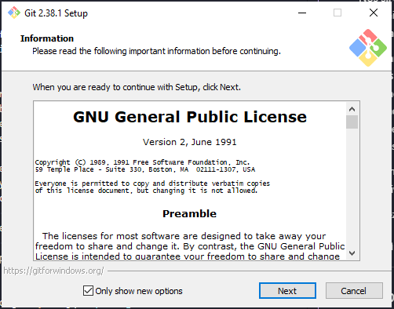

## Instalación de Git

### Windows

Lo primero es acceder a la pagina de descargas de Git, puedes hacerlo haciendo clic [**aquí**](https://git-scm.com/downloads), en este sitio encontraremos el link de descarga para cada los sistemas operativos mas usados, haremos clic en el nuestro y seleccionando el instalador, en mi caso windows 64 bits setup se iniciará automaticamente la descarga.

Una vez descargado el instalador, lo ejecutaremos, nos debe abrir un instalador como el siguiente.



En esta pantalla haremos clic en siguiente sin modificar ninguna de las opciones hasta que lleguemos a la opción instalar, aquí le daremos clic y esperaremos a que finalice el proceso de instalación. Una vez finalice la ejecución de la instalación haremos clic en finalizar y listo, tendremos git instalado en nuestra maquina.

Una vez instalado Git, en el buscador de aplicaciones de nuestro sistema operativo buscaremos una aplicación llamada Git Bash, esta aplicación es la consola de Git que ya tendremos instalada en nuestra maquina para empezar a trabajar con Git. Debería lucir algo así.


Ejecutemos el comando `git` simplemente copiandolo y pulsando enter, deberíamos tener una respuesta como la siguiente.


Este mismo comando debemos verificar en la consola local de nuestro sistema operativo que tenga respuesta correcta, que se reconozca el comando. Si es así, confirmamos que nuestra instalación fue exitosa y podemos continuar.

### Linux

Si quieres instalar Git en Linux a través de un instalador binario, en general puedes hacerlo mediante la herramienta básica de administración de paquetes que trae tu distribución. Si estás en Fedora por ejemplo, puedes usar yum:

```
$ yum install git
```

Si estás en una distribución basada en Debian como Ubuntu, puedes usar apt-get:

```
 $ apt-get install git
```

Para opciones adicionales, la página web de Git tiene instrucciones de instalación en diferentes tipos de Unix. Puedes encontrar esta información en [http://git-scm.com/download/linux](http://git-scm.com/download/linux).

### Mac os

Hay varias maneras de instalar Git en un Mac. Probablemente la más sencilla es instalando las herramientas Xcode de Línea de Comandos. En Mavericks (10.9 o superior) puedes hacer esto desde el Terminal si intentas ejecutar _git_ por primera vez. Si no lo tienes instalado, te preguntará si deseas instalarlo.

Si deseas una versión más actualizada, puedes hacerlo a partir de un instalador binario. Un instalador de Git para OSX es mantenido en la página web de Git. Lo puedes descargar en [http://git-scm.com/download/mac](http://git-scm.com/download/mac).

Ahora miremos como utilizar Github, esta herramienta que implementa Git para versionamiento de código, ingresemos a la pagina de Github haciendo clic [**aquí**](https://github.com/).

Una vez en la pagina nos podemos crear una nueva cuenta ingresando nuestro correo electrónico y haciendo clic en Sign up for GitHub.

Una vez completamos el proceso de registro ya tendremos una cuenta de GitHub, ahora vamos a asociar esta cuenta de GitHub a nuestra consola de git en nuestra maquina para conectar así nuestra cuenta y podes gestionar nuestros repositorios de código desde GitHub.

Primero configuraremos nuestro nombre de usuario de Git, ejecutando el siguiente comando

```
git config --global user.name "Mona Lisa"
```

En este ejemplo nuestro nombre de usuario es Mona Lisa, por supuesto reemplazaremos aquí nuestro nombre de usuario deseado, para verificar si quedó bien configurado ahora ejecutaremos el comando sin el argumento del nombre de usuario, este debe retornarnos nuestro nombre de usuario

```
git config --global user.name
```

Luego tendremos que asociar nuestro correo electrónico para que nuestros commits que mas adelante veremos que son queden asociados a nuestro correo, esta configuración se hace con el siguiente comando

```
git config --global user.email "TU_CORREO"
```

Verificamos que el correo quedó bien configurado haciendo uso del siguiente comando

```
git config --global user.email
```

Debe retornarnos el correo ingresado anteriormente. La idea es que este correo sea el mismo con el que creamos la cuenta de GitHub para que queden asociados a la cuenta.

Finalmente tendremos que autenticarnos a Github desde Git, para esto bastará con intentar clonar un repositorio, GitHub nos abrirá una pagina web donde ingresaremos nuestro usuario y contraseña y quedaremos logeados para siempre en esa maquina.
