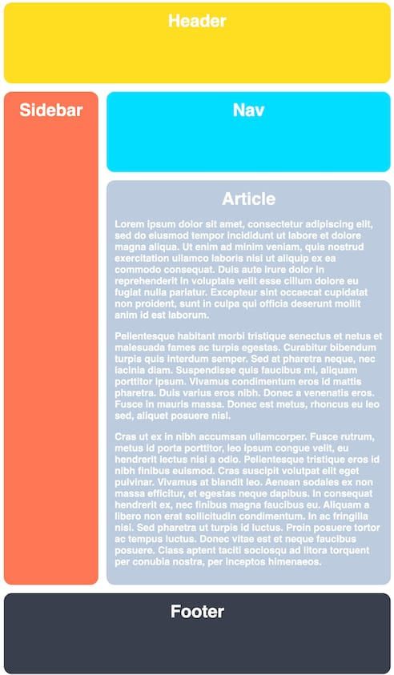

# Tareas del modulo

Las tareas de los módulos son pensadas para profundizar en los temas expuestos e interiorizar más el conocimiento.

## Tareas

Aplica los estilos dados según las condiciones especificadas de manera de llegar a la imagen ejemplo, recuerda que en cuanto a estilos hay infinitas maneras de llegar a la misma solución:

1. Usando CSS grid áreas desarrolla la siguiente layout

   - 

2. Tarea final de Grid, utilizando CSS grid desarrolla la siguiente layout (ESTE PUNTO ES OPCIONAL)

   - 
