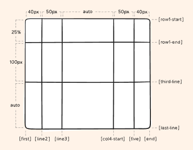
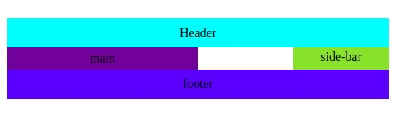
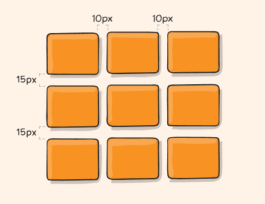
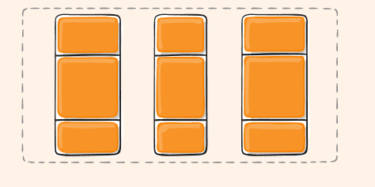
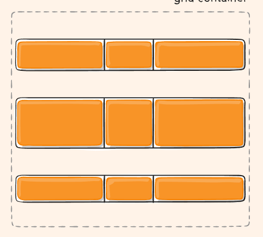
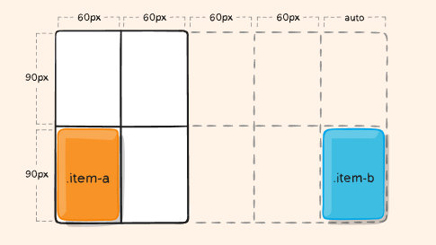
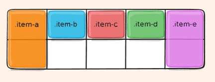
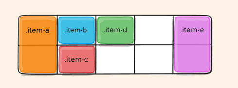
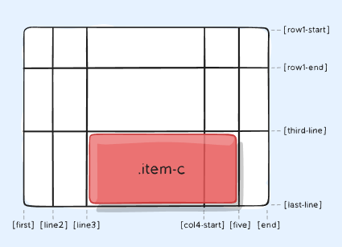

## Grid View

Grid view es otra alternativa para trabajar el layout de nuestras aplicaciones, esta se basa en una malla de dos dimensiones, al igual que flexbox esta tiene propiedades para un elemento padre o el también llamado contenedor y para sus elementos hijos o llamados ítems.

Miremos entonces inicialmente las propiedades para los elementos contenedores de esta distribución.

### **Propiedades Padre**

- `display` Esta propiedad al igual que para el caso de flexbox es la que nos establece un elemento como un contenedor grid
  - ```
          .container {
            display: grid | inline-grid
          }
    ```
  - Esta propiedad indica si vamos a trabajar con el flujo normal de la distribución grid o si trabaja con la versión inversa `inline-grid`
- `grid-template-columns | grid-template-rows` Esta propiedad nos permite definir la disposición de las filas y columnas de nuestro grid, es una de las propiedades fundamentales de los contenedores grid y realmente puede resultar algo compleja de entender, mirémoslo.

  - ```
      .container {
        grid-template-columns: ...  ...;
        /* ejemplo
            1fr 1fr
            minmax(10px, 1fr) 3fr
            repeat(5, 1fr)
            50px auto 100px 1fr
        */
        grid-template-rows: ... ...;
        /* e.g.
            min-content 1fr min-content
            100px 1fr max-content
        */
      }
    ```
  - El entendimiento puede resultar un poco confuso, mirémoslo con calma
  - Nosotros podemos indicar el nombre de las filas o columnas o no hacerlo, es opcional, para indicar el nombre usamos las llaves `[]`, por ejemplo.
  - ```
      .container {
        grid-template-columns: [first] 40px [line2] 50px [line3] auto [col4-start] 50px [five] 40px [end];
        grid-template-rows: [row1-start] 25% [row1-end] 100px [third-line] auto [last-line];
      }
    ```
  - En este caso tenemos un ejemplo donde nombramos columnas arbitrariamente, podemos hacerlo sin ningún tipo de problema, miremos la imagen para guiarnos del resultado final de esta declaración.
  - 
  - Como podemos notar, las filas y columnas se posicionan según el orden en que las definamos y toman sus espacios de acuerdo al que les asignemos seguido de cada identificador
  - Los nombres de las columnas o filas pueden ser varios de hecho, por ejemplo, un nombre válido podría ser `[columna1 primeraColumna]`
  - Si tenemos una secuencia de propiedades podemos usar la función `repeat` para facilitarnos el trabajo de definirlas
  - ```
      .container {
        grid-template-columns: repeat(3, 20px [inicio-columna]);
      }
      /* Esto es lo mismo que lo de arriba */
      .container {
        grid-template-columns: 20px [inicio-columna] 20px [inicio-columna] 20px [inicio-columna];
      }
    ```
  - Finalmente, podemos utilizar la unidad fr para referirnos al espacio libre dejado luego de darle el espacio necesario a cada elemento, por ejemplo
  - ```
      .container {
        grid-template-columns: 1fr 1fr 1fr;
      }
    ```
  - En este caso todas las columnas tomarán el espacio libre por igual, este espacio libre es calculado luego de que se le asignó el espacio a todos los ítems no flex, es decir, con un size definido. Por ejemplo
  - ```
      .container {
        grid-template-columns: 1fr 50px 1fr 1fr;
      }
    ```
  - En este caso los 50px de la segunda columna no se toman en cuenta para la repartición de los fr

- `grid-template-areas` Nos permite definir areas dentro de nuestro template, es otra manera de definir la distribución de nuestro grid pero esta vez llamando por areas las zonas, la definición misma nos da luces de la estructura resultada

  - ```
      .container {
        grid-template-areas:
          "<grid-area-name> | . | none | ..."
          "...";
      }
    ```
  - En este ejemplo visualizamos los posibles valores para cada area de nuestro template, pueden ser el nombre del area, `.` para indicar que es una celda vacía o `none` para indicar que es un area no definida
  - ```
      .item-a {
        grid-area: header;
      }
      .item-b {
        grid-area: main;
      }
      .item-c {
        grid-area: sidebar;
      }
      .item-d {
        grid-area: footer;
      }

      .container {
        display: grid;
        grid-template-columns: 50px 50px 50px 50px;
        grid-template-rows: auto;
        grid-template-areas:
          "header header header header"
          "main main . sidebar"
          "footer footer footer footer";
      }
    ```

  - Como vemos la misma manera como definimos el template nos da luces del resultado final, mirémoslo en una imagen y comparemos el resultado final, como veremos es bastante gráfico.
  - 
  - Cada fila de la declaración debe tener el mismo número de celdas
  - Esas áreas no están asociadas con ningún elemento de cuadrícula en particular, pero se puede hacer referencia a ellas desde las propiedades de ubicación de cuadrícula grid-row-start, grid-row-end, grid-column-start, grid-column-endy sus abreviaturas grid-row, grid-columny grid-area.
  - Hay algunas reglas al crear un diseño de esta manera. Romper las reglas hará que el valor no sea válido y, por lo tanto, su diseño no se realizará. La primera regla es que debe describir una cuadrícula completa , es decir, cada celda de su cuadrícula debe estar llena.
  - Solo puede definir cada área una vez , lo que significa que no puede usar esta propiedad para copiar contenido en dos lugares de la cuadrícula. Por lo tanto, el siguiente valor no sería válido y haría que se ignorara toda la propiedad

- `grid-template` Es una combinación entre las dos últimas propiedades vistas para ahorrarnos código al definir nuestra estructura, miremos el siguiente ejemplo

  - ```
    .container {
      grid-template:
        [row1-start] "header header header" 25px [row1-end]
        [row2-start] "footer footer footer" 25px [row2-end]
        / auto 50px auto;
    }
    ```
  - Esto es lo mismo que lo siguiente

  - ```
      .container {
        grid-template-rows: [row1-start] 25px [row1-end row2-start] 25px [row2-end];
        grid-template-columns: auto 50px auto;
        grid-template-areas:
          "header header header"
          "footer footer footer";
      }

    ```

  - A pesar de que nos recorta camino puede resultar un poco tedioso su entendimiento.

- `column-gap | row-gap | grid-column-gap | grid-row-gap` determina la margen entre las columnas o lineas, toman el valor de una unidad de medida y define ese valor para el salto de línea o de columna.

  - ```
      .container {
        grid-template-columns: 100px 50px 100px;
        grid-template-rows: 80px auto 80px;
        column-gap: 10px;
        row-gap: 15px;
      }

    ```

  - El ejemplo anterior representa lo siguiente
  - 
  - El prefijo grid, va a ser eliminado en futuras versiones de navegadores, por tanto usemos las versiones sin ellos

- `gap` Es un atajo para definir el row-gap y el column-gap, su sintaxis es `gap: <row-gap> <column-gap>`
- `justify-ítems` Indica el centrado horizontal que se le da cada celda dentro del contenedor portador de esta propiedad, puede tomar los valores `start`, `end`, `center`, `stretch` y su funcionamiento es exactamente el mismo que el visto en flexbox
- `align-ítems` Indica el alineado opuesto a justify-ítems, es decir, si nuestro eje principal es el por defecto, es decir, que justify-ítems trabaja horizontalmente, align-ítems lo hará vertical, nuevamente su funcionamiento es exactamente igual al de flexbox y los valores que puede tomar son exactamente los mismos que justify-content `start`, `end`, `center` y `stretch` que es para hacer coincidir el size de los ítems con el size de las celdas
- `place-ítems` Sirve como atajo para indicar en una sentencia tanto el justify-ítems como el align-ítems

  - ```
      .center {
        display: grid;
        place-ítems: center;
      }
    ```

- `justify-content` En ocasiones puede suceder que nuestra grid no cubra completamente nuestro contenedor, esto suele suceder por ejemplo cuando utilizamos unidades de medida fijas para las filas y columnas, para estos casos podemos utilizar esta propiedad para alinear nuestro grid dentro de nuestro contenedor, podemos utilizar los mismos valores que justify-content de flexbox y su funcionamiento es el mismo, debemos tener cuidado porque los justify que manejan espaciado entre elementos toman cada columna como un elemento, por lo que generarán espaciados entre ellos.
  - ```
    .container {
      justify-content: start | end | center | stretch | space-around | space-between | space-evenly;
    }
    ```
  - Ejemplo de space-evenly
  - 
- `align-content` Trabaja igual que el justify-content, cuando nuestro grid no alcanza el alto de nuestro contendero, podemos utilizarlo para alinear nuestro grid según requiramos
  - ```
    .container {
      align-content: start | end | center | stretch | space-around | space-between | space-evenly;
    }
    ```
  - Ejemplo de space-evenly
  - 
- `grid-auto-columns` Esta propiedad nos sirve para declarar el size de las celdas automáticamente generadas por elementos insertados en celdas no existentes, esta propiedad nos ayuda a manejar estos casos indicando un tamaño automático para las celdas generadas automáticamente
  - ```
    .container {
      grid-auto-columns: 60px;
    }
    ```
  - 
  - Como vemos en el ejemplo, nuestro grid era de 2x2 pero al definirle la regla de auto-columns y apuntar un item a una celda no existente este genera una con las dimensiones indicadas automáticamente.
- `grid-auto-flow` Nos sirve para indicarle a nuestra grid en que orden debe ingresar los elementos que ingresemos que no le indiquemos donde deben ir, puede tomar los valores de `row` o `column` miremos un ejemplo
  - ```
      .container {
        display: grid;
        grid-template-columns: 60px 60px 60px 60px 60px;
        grid-template-rows: 30px 30px;
        grid-auto-flow: row;
      }
    ```
    -Tenemos el anterior grid y le insertamos 5 ítems donde solo le indicamos posición a dos de la siguiente manera
  - ```
      <section class="container">
        <div class="item-a">item-a</div>
        <div class="item-b">item-b</div>
        <div class="item-c">item-c</div>
        <div class="item-d">item-d</div>
        <div class="item-e">item-e</div>
      </section>
    ```
  - ```
      .item-a {
        grid-column: 1;
        grid-row: 1 / 3;
      }
      .item-e {
        grid-column: 5;
        grid-row: 1 / 3;
      }
    ```
    -Como vemos solo le indicamos posición al primer y al último elemento, así entonces, la propiedad nos sirve para indicarle en que orden ingresar esos elementos que no dispusimos orden, si pusiéramos la propiedad en `row` el resultado final sería así
  - 
  - Esto puesto que el grid intenta llenar en orden de filas los espacios vacíos conforme entran nuevos elementos, en cambio, si lo hiciéramos con `column` lo que haría la grid sería llenar los espacios por columna
  - 

### **Propiedades de los ítems**

Al igual que en flexbox los ítems de los contenedores grid también cuentan con propiedades las cuales al encontrarse dentro de un padre con display: grid se activan e interactúan con este. Miremos cuáles son estas propiedades y como las podemos utilizar para dar una estructura a nuestros desarrollos.

- `grid-row | grid-column` Nos sirve para indicarle a nuestro item que celdas de nuestro grid ocupará, es importante destacar que esta propiedad es un atajo para `grid-column|row-start|end` pero que debido a su facilidad, es siempre implementada de esta manera y no de su contraparte más larga. Los valores que puede tomar son numéricos para referirse a las líneas o columnas en orden, de cadenas de texto que indiquen el nombre identificador de la línea o columna o pueden utilizar la palabra clave `span` que seguida de un número indica cuantas filas o columnas més se expande el ítem o de un nombre identificador de fila o columna, indica que se expande hasta ella. Miremos un ejemplo
  - ```
        .item-c {
          grid-column: 3 / span 2;
          grid-row: third-line / 4;
        }
    ```
  - Como podemos visualizar indicamos que item-c va desde la fila con identificador third-line hasta la fila número 4 y desde la columna 3 y se expande 2 más, según la convención de `span`. El resultado visual de esta inserción sería el siguiente
  - Finalmente esa es la convención siempre `grid-row|column: <indicadorInicio> / <indicadorFin>`
  - 
- `grid-area` Apoyada de la propiedad de los contenedores grid `grid-template-areas` nos sirve para indicarle un area del grid la cual tomará nuestro elemento.
  - ```
    .item-d {
      grid-area: header;
    }
    ```
  - También se puede utilizar como atajo para en una línea indicar la ubicación de un item con la estructura ` grid-row-start + grid-column-start + grid-row-end + grid-column-end`
  - ```
    .item-d {
      grid-area: 1 / col4-start / last-line / 6;
    }
    ```
- `justify-self` Sobreescribe el valor de justify-ítems del contenedor y aplica solo para el item portador de la propiedad, puede tomar los mismos valores y funciona de la misma manera que `justify-ítems`
- `align-self` Sobreescribe el valor de align-ítems del contenedor y aplica solo para el item portador de la propiedad, puede tomar los mismos valores y funciona de la misma manera que `align-ítems`
- `place-self` Atajo para nombrar propiedades de justify y align self en una linea, maneja la siguiente estructura `place-self: <align-self> <justify-self>`

### Tamaños alternativos

Para asignar espacio a nuestras celdas podemos utilizar alternativos de los cuales ya vimos algunos, miremos el resto

- `min-content` Minimo tamaño para contener el contenido del item, es decir, para contener solo una parte
- `max-content` Maximo tamaño para contener el contenido del item, es decir, para contenerlo todo
- `auto` Toma el restante espacio luego de los demás cálculos
- `fit-content` Usa el espacio disponible pero nunca menos de min-content ni mas de max-content

### Funciones para Tamaños

Para indicar tamaños también podemos usar tres funciones que nos ayudan a establecer reglas, mirémoslas.

- `minmax()` Recibe dos parametros los cuales son el mínimo y el maximo para el espacio para dicha celda, es util en combinación con unidades relativas como `fr`, por ejemplo `minmax(100px, 1fr) 3fr`
- `min()` Indica un valor mínimo para el espacio de una celda
- `max()` Indica un valor máximo para el espacio de una celda

Hasta aquí el contenido de grid, ahora miremos como complementar estos dos tipos de layout tan completos de manera que creemos aplicaciones con todas las buenas prácticas.
## Final del módulo

Llegamos al final de este módulo en el cual aprendimos sobre `grid` y `media queries` en general vimos los elementos que necesitamos para tener claro como se da un desarrollo responsive y que nos deja sin duda frente a un panorama mucho mas claro en cuanto a buenas practicas para tener desarrollos frontend con un nivel mucho mas productivo. En los siguientes modulos empezaremos a profundizar sobre manejadores de versiones de códigos y profundizaremos mas sobre Javascript y su implementación al desarrollo web.
