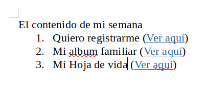
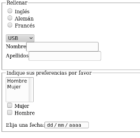

## Tarea

1.  Construye un archivo HTML, en el que vas a crear el contenido de tu semana como se ve en la imagen:
    

- El enlace del item 1, debe abrir en una pestaña nueva del navegador, el formulario de registro del punto 1 de la tarea 2.
- El enlace del item 2, debe abrir en una pestaña nueva del navegador, el album familiar del punto 2 de la tarea 2.
- El enlace de la item 3, debe abrir en la misma pestaña del navegador la hoja de vida de la tarea 1

2. Construye un archivo HTML, en el que vas a crear un formulario que tenga las siguientes caracteristicas:
   

- Contiene los siguientes radiobuttons:radio con el name «idioma» , value «idiomaingles» y el texto «Inglés», radio con el name «idioma» , value «idiomaaleman» y el texto «Alemán», radio con el name «idioma» , value «idiomafrances» y el texto «Francés».

- Hay una lista desplegable con el name «conector» y con las siguientes opciones: opción «USB» con el value usb, opción «Paralelo» con el value paralelo, opción «PS2» con el value ps2.

- Hay los siguientes cuadros de texto:cuadro de texto con el texto «Nombre» y el name nombre, cuadro de texto con el texto «Apellidos» y el name apellidos

- Hay una lista desplegable múltiple con el name «sexo» y con las siguientes opciones: opción «Hombre» con el value hombre, opción «Mujer» con el value mujer.

- Contiene los siguientes checkboxes:checkbox con el name «sexo» , value «sexomujer» y el texto «Mujer», checkbox con el name «sexo» , value «sexohombre» y el texto «Hombre».

- Hay un control para indicar la fecha.
