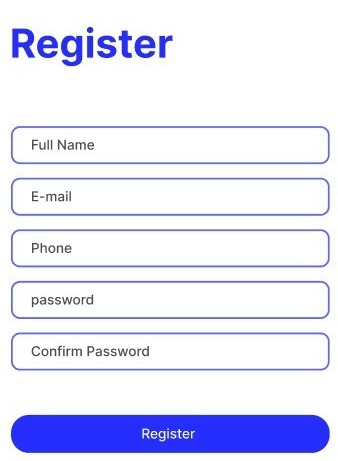
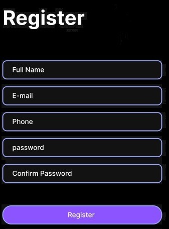

# Tareas del módulo

Las tareas de los módulos son pensadas para profundizar en los temas expuestos e interiorizar más el conocimiento.

## Tareas

En la generación de estilos hay infinitas maneras de llegar a un mismo resultado, así es que el punto de estas tareas es que pongas en práctica el conocimiento y generes estructuras utilizadas frecuentemente en páginas web de producción, no es necesario tener la respuesta 100% igual a la propuesta.

1. Crea un formulario de registro de usuarios que se vea como el de la siguiente imágen. Los criterios de diseño son:
   - los textos debe usar un tipo de fuente `font-family: sans-serif;`
   - El titulo "Register" tiene un color de fuente `color: #252EFF`, un tamaño de fuente 24px, y un `font-weight: 700;`. Recuerda, la propiedad font-weight define el ancho de la fuente (nivel de negrita).
   - Todos los input tiene un borde sólido `border-style: solid;` de 2px  `border-width: 2px;` y de color `border-color: #6066FF;`
   - Para que los input se vean con un borde redondeado usa la propiedad border radius `border-radius` de `border-radius: 10px;`;
   - El botón "Register" tiene un color de fuente blanco `color: white;` de 15px `font-size: 15px;` y un color de fondo de color `background-color: #252EFF;`
   - Para el botón se vean con un borde redondeado usa la propiedad border radius, `border-radius: 20px;`
   - El botón e inputs deben tener un ancho  `width` de 350px `width: 350px;`.

   - 
2. Ahora intenta hacer la version dark de tu formulario de registro. 
   Crea una nueva hoja de estilos para que tu formulario se vea de la siguiente forma:

   - El body debe tener un color de fondo negro 
   ```css
   body { 
      background-color: black; 
   }
   ```
   - Todos los input tiene un borde sólido `border-style: solid;` de 2px de ancho  `border-width: 2px;` y de color `border-color: #9CA6FF;`
   - Los botones deben tener un borde sólido `border-style: solid;` de 2px  de ancho `border-width: 2px;` y de color `border-color: #9CA6FF;`
   - El botón "Register" debe tener un color de fondo  `background-color: #8B54FF`
   - 


