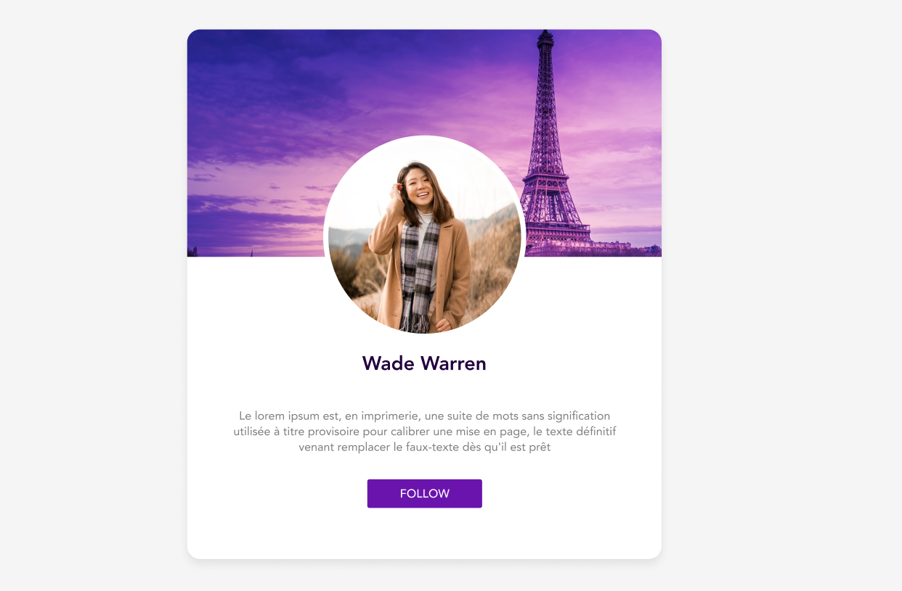
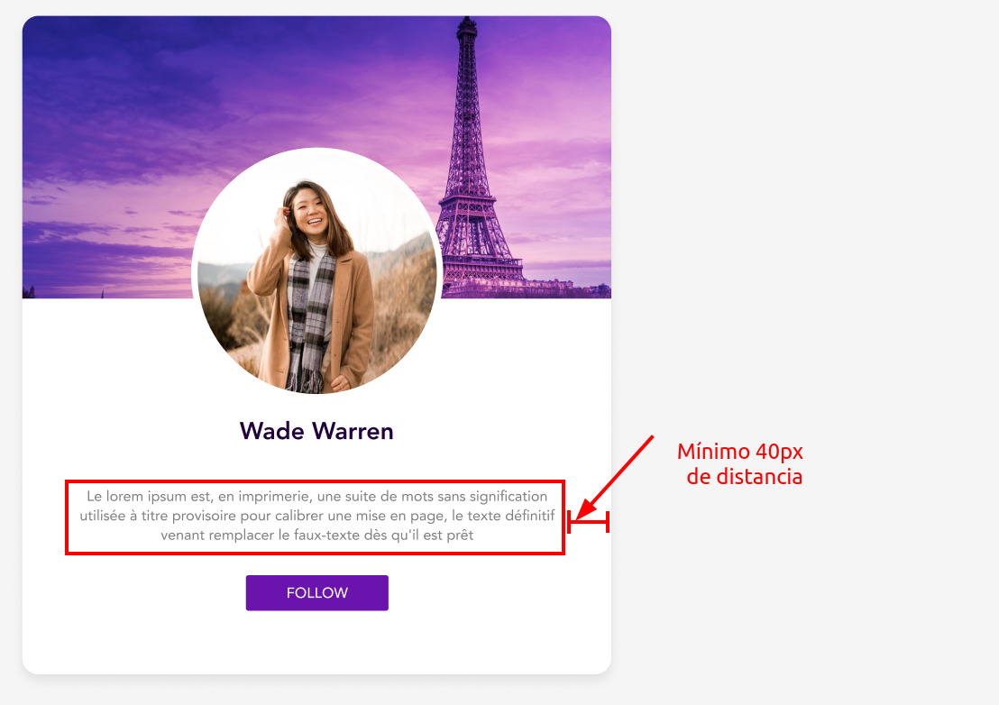

# Tareas del módulo

Las tareas de los módulos son pensadas para profundizar en los temas expuestos e interiorizar más el conocimiento.

## Tareas

En la generación de estilos hay infinitas maneras de llegar a un mismo resultado, así es que el punto de estas tareas es que pongas en práctica el conocimiento y generes estructuras utilizadas frecuentemente en páginas web de producción, no es necesario tener la respuesta 100% igual a la propuesta.

1. Crea tu propia tarjeta de presentación, a continuación te presentamos un modelo:
   
   - Debes usar clases para dar estilo a los elemntos de la página
   - Toda la pagina debe usar un tipo de fuente `font-family: sans-serif` y un color de fondo `lightgray`
   - La tarjeta de presentación debe tener un ancho de 729px, un fondo blanco y un `border-radius: 20px`
   - La imagen de fondo (paris.jpeg) debe tener un alto de 350px
   - La foto de perfil debe tener un ancho de 312px, un borde solido de 8px y de color blanco
   - El nombre debe tener un tamaño de fuente de 30px `font-weight: 700` y color `#23003E`
   - El texto con la descripción del perfil debe tener un tamaño de fuente de 12px `font-weight: 400` y color `#7E7E7E`;
   - El color de botón debe ser `#6A14AD` y debe tener un padding lateral (izquerda y derecha) de 20px y vertica (arrriba y abajo) de 10px, y un `border-radius: 3px`. 
   - Las imágenes de prueba las vas a encontrar en la carpeta ./homework_resources
   - Recuerda que puedes alinear o justificar un parrafo con la propiedad `text-align`
   - Plus: Intenta centrar la tarjeta en el body utilizando margenes automáticas para que se vea siempre centrado independientemente del ancho de la pantalla
   - Plus2: Al pasar el mouse por el botón el color de fondo debe cambiar a `#460d73`

## Importante
Los textos y la imágen de perfil deben quedar centrados en la tarjeta
debe mínimo haber una separación de 40px entre  los textos y el borde de la tarjeta
  

