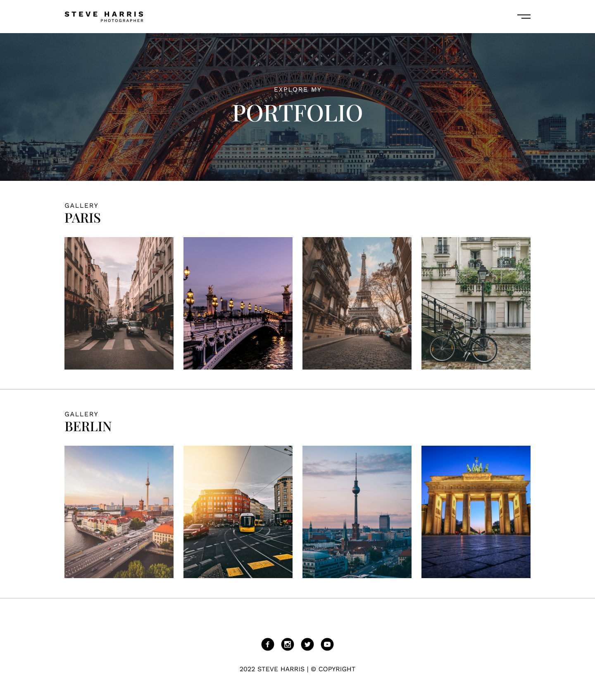

# Tareas del modulo

Las tareas de los módulos son pensadas para profundizar en los temas expuestos e interiorizar más el conocimiento.

## Tareas

1. Usando flexbox intenta replicar la siguente página web:
   - El banner principal debe ser un div con la imagen de parís como background
   - Utiliza flex wrap `flex-wrap: wrap;` en las imágenes de berlin y paris para que se vean bien cuando renderices tu página en una pantalla más pequeña
   - _Plus:_ si quieres que la imágen del banner principal tenga una capa gris y se vea igual que el diseño intenta agregar el siguiente estilo `background-image: linear-gradient(0deg, #00000080 0%, #00000080 100%), url("<URL_DE_LA_IMAGEN>");`. Investiga sobre gradientes en CSS3 para entender cómo funciona esto https://www.w3schools.com/css/css3_gradients.asp
   - Los iconos e imágenes para esta tarea necesarias los vas a encontrar en la carpeta `./homework-resources`
   - 
