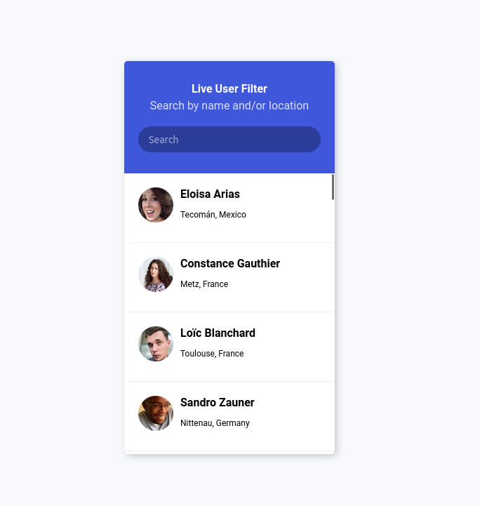

# Tareas del modulo

Las tareas de los módulos son pensadas para profundizar en los temas expuestos e interiorizar más el conocimiento.

## Tareas

1. Replica la siguiente tarjeta usando flexbox:
    - La tarjeta debe tener un ancho de `350px` y estar centrada en el body.
    - Para separar los elementos en flex-direction, justify-content, align-items, y gap 
    - *OPCIONAL*: El contendor de usuarios debe tener al menos 8 usuarios, pero unicamente deben aparecer 4 usuarios y se debe permitir hacer scroll para ver los demás. Para ello te recomendamos asignaler un alto (`height`) fijo al contendor de usuarios y utilizar la propiedad `overflow-y: scroll;`
      Video demo: 
    - 
